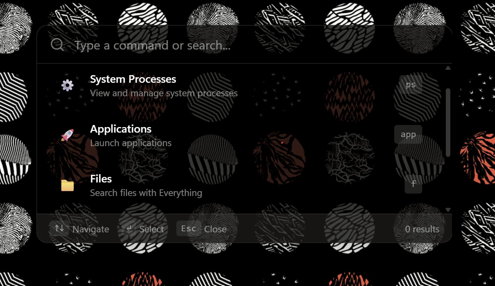
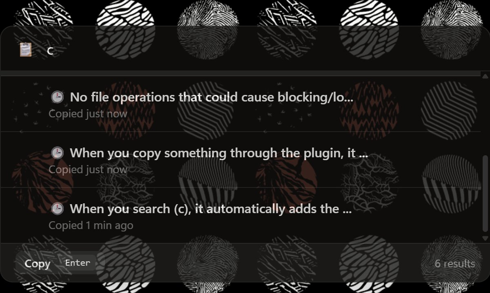
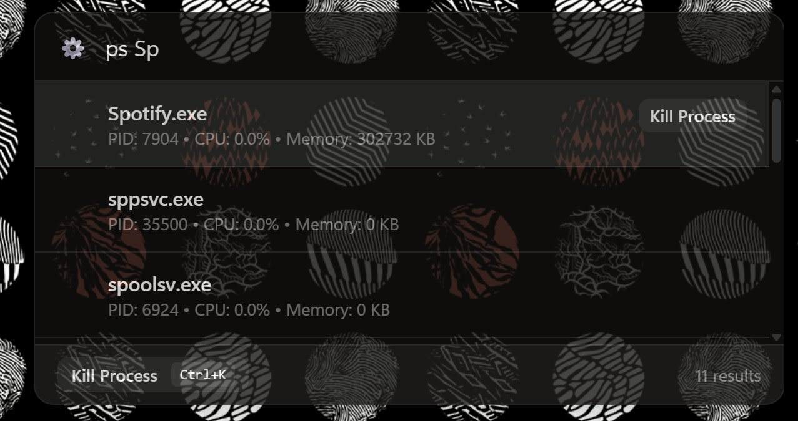
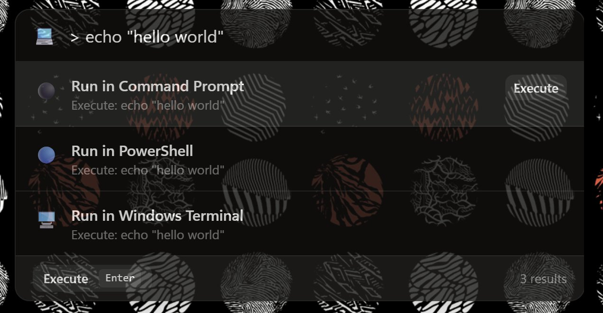
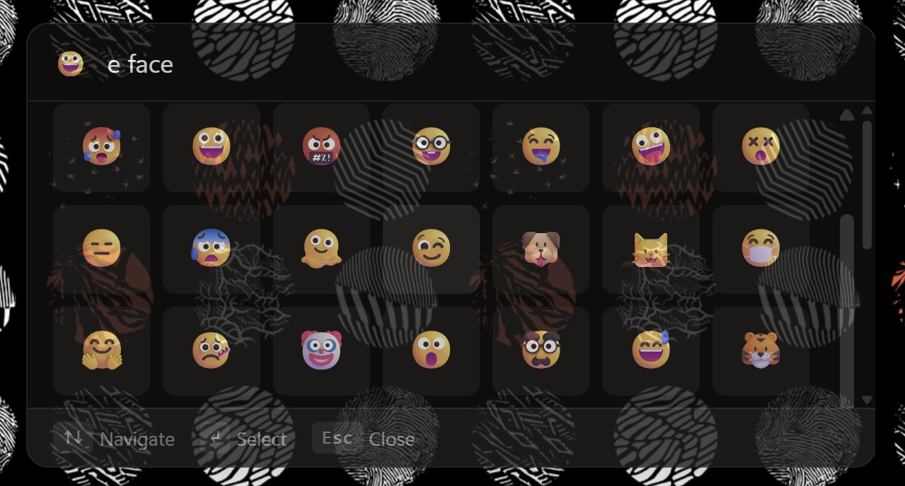
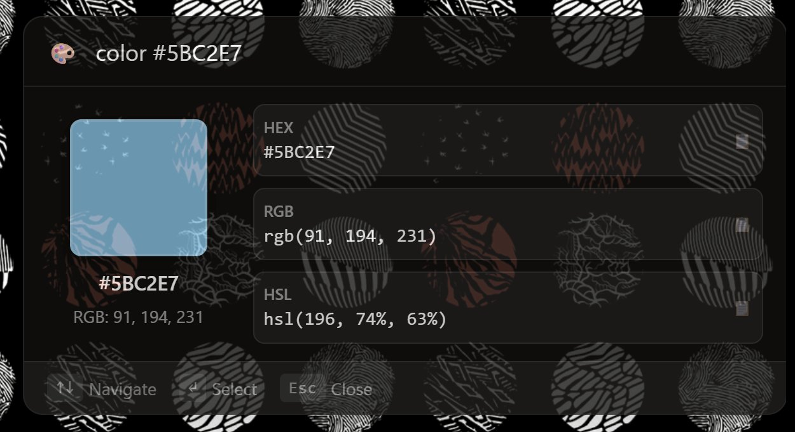
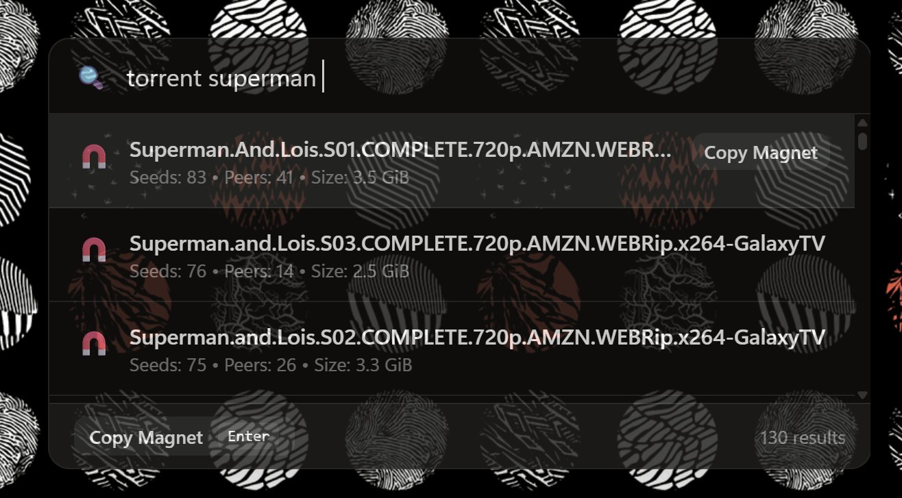

## Introduction

Dossier is a high-performance, cross-platform command palette application built with Rust, Tauri, and Svelte. While tools like [Raycast](https://www.raycast.com/), [Flow Launcher](https://www.flowlauncher.com/), [PowerToys Run](https://learn.microsoft.com/en-us/windows/powertoys/run), and [cmdPal](https://github.com/sysid/cmdpal) exist, I found them overwhelming and not as customizable as I wanted. Each had aspects I disliked, whether it was complexity, limited customization, or cumbersome plugin development.

Dossier takes a different approach: it's simple enough to understand and customize with just a single CSS line, and plugins are just a single Rust file compiled to a library. No enterprise frameworks, no bloated configurations—just straightforward, powerful customization.

  
_The main command palette interface with system processes, applications, and file search capabilities._

## Core Features

### Lightning-Fast Performance

Built with Rust at its core, Dossier delivers extremely low latency and minimal memory footprint. The application is designed for instant response times, making it feel native and responsive even with complex operations.

### Modular Plugin Architecture

One of Dossier's standout features is its plugin system. Unlike traditional command palettes that require full C# projects or complex setups, Dossier plugins are simple:

- Write a single Rust file
- Compile to a dynamic library
- Hot-load at runtime
- Watch scripts automatically rebuild and link plugins during development

This approach makes extending functionality straightforward and accessible to developers of all skill levels.

### Built-in Plugins

Dossier comes with several powerful plugins out of the box:

#### Clipboard Manager

  
A full-featured clipboard history that allows you to search, copy, and paste previous clipboard entries with timestamps.

#### Process Manager

  
View and manage system processes with detailed information including PID, CPU usage, memory consumption, and the ability to kill processes directly from the command palette.

#### Shell Execution

  
Execute shell commands in various terminals (Command Prompt, PowerShell, Windows Terminal) without leaving the command palette.

#### Emoji Indexer

  
Search and copy emojis by description using the Unicode 17 emoji database. Supports both list and grid views for easy browsing.

#### Color Converter

  
Convert colors between HEX, RGB, and HSL formats with live preview and easy copying.

#### Torrent Indexer

  
Search torrents with magnet links, seed counts, and peer information (use responsibly).

## Technical Architecture

### Tech Stack

- **Rust**: Core application logic and plugin system
- **Tauri**: Cross-platform desktop framework
- **Svelte**: Reactive UI framework for the interface

### Customization

Dossier is highly customizable through multiple configuration layers:

- **JSON Settings**: Configure application behavior and plugin options
- **Keyboard Shortcuts**: Define custom keybindings for all actions
- **CSS Styling**: Fully customize the appearance of the interface
- **Plugins**: Extend functionality with Rust-compiled dynamic libraries

### Custom HTML Rendering

Plugins can render custom HTML interfaces and call Rust functions directly from the UI, enabling complex interactions and visualizations like the emoji grid and color converter.

## Cross-Platform Support

Dossier runs seamlessly on Windows, macOS, and Linux, providing a consistent experience across all platforms without the pain points of platform-specific implementations.

## Philosophy

Dossier was built on the principle of "reject modernity, reinvent the wheel" - not for the sake of reinvention, but to create a tool that prioritizes:

- **Performance over features**: Fast and responsive, not bloated
- **Simplicity over complexity**: Easy plugin development, not enterprise frameworks
- **Customization over opinionation**: Your workflow, your way

The result is a command palette that feels native, responds instantly, and adapts to your needs.
